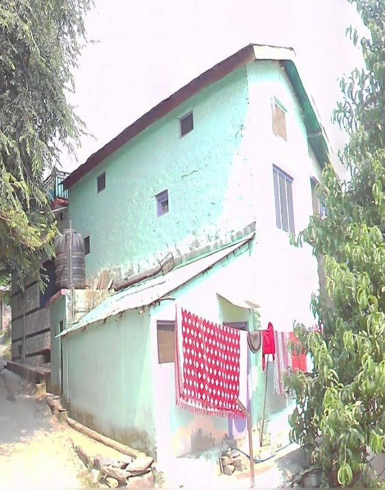

# Exposure-model-using-Transformers
This repository contains the code to process the images and train models for building a classification using Google Street View images and Vision Transformers.
## Repository Content

**Data/:** Contains representative GSV image data for each class used to train the models.

**Code/:** Jupyter notebooks for data processing and Model training.

## Different classes of buildings which the present model classifies:

|  |  |  |  | |
|--------------------------------|--------------------------------|--------------------------------|--------------------------------|--------------------------------|
| **AD_H1** | **AD_H2** | **METAL_H1** | **MR_H1 flat roof** | **MR_H1 gable roof** |
|  |  |  |  | |
| **MR_H2 flat roof** | **MR_H2 gable roof** | **MR_H3** | **NON_Building** | **RCC_H1 flat roof** |
|  |  |  |  | |
| **RCC_H1 gable roof** | **RCC_H2 flat roof** | **RCC_H2 gable roof** | **RCC_H3 flat roof** | **RCC_H3 gable roof** |
|  |  |  |  | |
| **RCC_H4 flat roof** | **RCC_H4 gable roof** | **RCC_H5** | **RCC_H6** | **RCC_OS_H1** |
|  |  |  |  | |
| **RCC_OS_H2** | **RCC_OS_H3** | **RCC_OS_H4** | **Timber** | 

#### Note: This repository shares the data for the study "Machine Learning-based Rapid Building Classification Using Street View Images and Subsequent Risk Assessment" (Under Review).

### Authors
1. Sukh Sagar Shukla
2. Amit Bhatiya
3. J Dhanya
4. Saman Ghaffarian
5. Roberto Gentile
